  

  

    <strong>Software Engineer · Backend · Distributed Systems · Cross-platform Development</strong>
  

  

    <strong>软件工程师 · 后端 · 分布式系统 · 跨平台开发</strong>
  

  

    
    
  

---

## About / 关于我

**EN**

I'm a software engineer interested in **backend development, distributed systems, and cross-platform applications**.

I enjoy working across different layers of a system — from application architecture and APIs to concurrency, performance, infrastructure, and developer tooling.

I'm particularly interested in building software that is:

* Simple to understand
* Reliable in production
* Efficient under load
* Easy to maintain
* Designed to scale

**中文**

我是一名专注于 **后端开发、分布式系统以及跨平台应用** 的软件工程师。

喜欢从系统整体角度解决问题，从应用架构、API 设计，到并发、性能、基础设施以及开发工具，都有持续探索。

更关注软件是否能够做到：

* 简单易懂
* 稳定可靠
* 高效运行
* 易于维护
* 面向扩展

---

## Interests / 技术方向

### Backend / 后端

* Java
* Go
* Spring Boot
* REST API
* gRPC
* WebSocket
* Concurrent Programming
* Distributed Systems

### Cross-platform / 跨平台

* Flutter
* Dart
* Desktop Applications
* Mobile Applications

### Infrastructure / 基础设施

* Linux
* Docker
* Kubernetes
* Git
* Observability
* Performance Engineering

---

## Tech Stack / 技术栈

### Languages / 编程语言

  
  
  

### Backend / 后端

  
  
  
  

### Client / 客户端

  
  

### Infrastructure / 基础设施

  
  
  
  

---

## Engineering Philosophy / 工程理念

> **Keep it simple.**
> 简单优先。

> **Measure before optimizing.**
> 先测量，再优化。

> **Design for failure.**
> 从失败场景开始设计。

> **Build for maintainability.**
> 不只解决今天的问题，也考虑未来的维护成本。

---

## GitHub Stats / GitHub 数据

---

## Contributions

  

---

  

  

Java · Go · Flutter · Distributed Systems · Open Source

